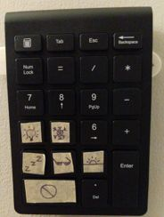

# Home Assistant DIY Keypad

System for a cheap, tactile scene-setting device.

This addresses the issue that physical buttons for Home Assistant have few buttons and are expensive. This system allows a wireless keypad to be used instead.

## Setup

1. Acquire a wireless keypad (I used [this one](https://www.amazon.com/dp/B07RZZMV62)) and a nearby computer to be a listener.
1. Create a long lived token and store it token.txt.
1. Open scenes.txt. Replace the this_is_key_X with the desired scene id.
1. Open bind-keypad.service. Replace the variables and install.
1. Decorate! Draw some cute icons on the keys you've mapped!

## Considerations:

1. For multiple keypads, duplicate the service, scenes.txt, and edit references appropriately.
1. Recommended to have the listener near the keypad and to have a wired connection for minimal latency.
1. Early generation raspberry pis have no SSL hardware acceleration, creating ~3 seconds latency. If you use this, set up some HTTP pathway.